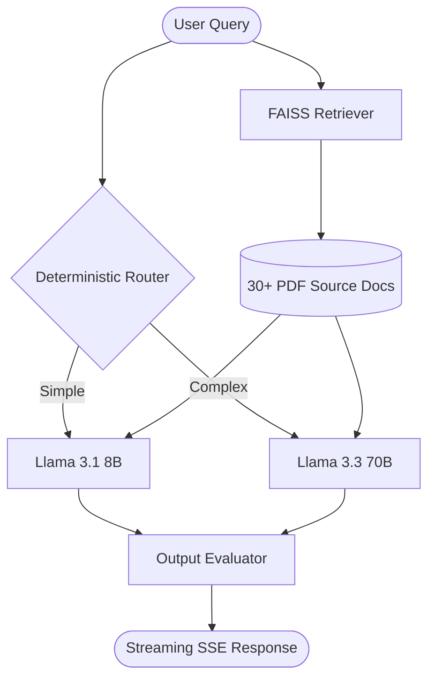

# ClearPath AI Assistant: Professional RAG Implementation

[](https://clearpath-assistant-590138312966.us-central1.run.app)
[](#tech-stack)

A robust, enterprise-grade RAG (Retrieval-Augmented Generation) chatbot designed for **ClearPath**, a project management SaaS. This system provides instant, faithful answers based on 30+ internal product documents, technical guides, and business protocols.

---

## Technical Overview

### 1. High-Performance Streaming UI
- **Token-by-Token Streaming**: Leveraging SSE (Server-Sent Events) for real-time response generation.
- **Queue-Buffered Typewriter Effect**: Implemented a token drainage system to ensure a smooth, fluid reading experience without "jitter" from uneven network packets.
- **Premium Aesthetics**: Glassmorphism UI, responsive sidebar, and interactive markdown rendering.

### 2. Deterministic Query Routing (Cost & Latency Optimized)
Instead of using an expensive LLM call to classify queries, I implemented an **Additive Signal Classifier**:
- **Scoring Engine**: Analyzes word count, linguistic complexity (sub-clauses, negations), and specific intent keywords (comparison, explanation).
- **Dynamic Model Selection**: 
  - `score < 3`: Routed to **Llama 3.1 8B** (Instant, cost-efficient).
  - `score >= 3`: Routed to **Llama 3.3 70B** (Complex reasoning, multi-step logic).
- **Post-Retrieval Upgrade**: Automatically upgrades "simple" queries to the 70B model if retrieval spans multiple conflicting documents.

### 3. Faithfulness & Grounding Evaluator
To prevent hallucinations (the key challenge in RAG), every response undergoes an automated audit:
- **Grounding Score**: Calculates cosine similarity between the generated answer and the source context.
- **Refusal Detection**: Automatically flags responses where the LLM admits it doesn't know the answer.
- **Faithfulness Flags**: Alerts the user (or system admin) if the response has low semantic grounding in the provided documents.

---

## Models and Environment Configuration

### LLM Models Used (via Groq)
- **Primary (Complex)**: `llama-3.3-70b-versatile` — Used for multi-step reasoning, comparisons, and deep technical explanations.
- **Secondary (Fast)**: `llama-3.1-8b-instant` — Used for simple greetings, FAQs, and direct lookups.

### Environment Variables
| Variable | Required | Description |
|---|---|---|
| `GROQ_API_KEY` | Yes | Your Groq Cloud API key. |
| `PROJECT_ROOT` | No | Overrides the document source directory (defaults to `./clearpath_docs`). |
| `PORT` | No | Container port (defaults to 8080). |

---

## Bonus Challenges Attempted

1.  **Streaming Responses**: Fully implemented token-by-token streaming from the Groq API through FastAPI to the React frontend.
2.  **Conversational Memory**: Implemented conversation memory with persistent local JSON storage.
3.  **Deployment Excellence**: Deployed as a optimized monolith container on Google Cloud Run.

---

## Local Setup and Run Commands

### 1. Prerequisites
- Python 3.10+
- Node.js 20+
- A [Groq API Key](https://console.groq.com/)

### 2. Backend Setup
```bash
# From the project root
cd backend
python -m venv venv
source venv/bin/activate  # On Windows use `venv\Scripts\activate`
pip install -r requirements.txt

# Create .env and add your key
echo "GROQ_API_KEY=your_key_here" > .env

# Start the server (The first run will take ~30s to index the PDFs)
uvicorn app.main:app --host 0.0.0.0 --port 8000
```

### 3. Frontend Setup
```bash
# From the project root in a new terminal
cd frontend
npm install
npm run dev
```
Navigate to `http://localhost:5173`.

---

## Architecture



---

## Known Issues and Limitations

- **PDF Extraction**: Complex tables in PDFs may occasionally lose formatting in the RAG context.
- **No Authentication**: The conversation history is stored in a local JSON file, which is not secure and is not persistent.
- **No Rate Limiting**: The API is not rate limited, which can lead to abuse.
- **Consistancy in Response**: The response are mostly but not always consistent in terms of the context provided to the LLM.
---

**Developed by Tirth**
